# Comprehensive CI/CD Pipeline Testing and Validation Guide

## Introduction  
Designing a CI/CD pipeline requires choosing the right checks and tests at each stage based on the context of the codebase. This guide provides a systematic framework for selecting validations and tests for **scripting languages** (e.g. Bash, PowerShell), **interpreted languages** (e.g. Python, JavaScript, Ruby), and **compiled languages** (e.g. C#, Java, Go). We will distinguish between syntax checks, linting, schema validation, security analyses, and various test types (unit, integration, contract, end-to-end, performance, etc.). Context-specific logic (like *failing fast* on syntax errors, using mocks for external dependencies, validating schemas for config/data, and deciding when end-to-end or contract tests are needed) is emphasized throughout. The goal is to equip DevOps engineers, developers, and even LLM/GenAI agents with a clear decision framework to build a **context-aware CI/CD pipeline** that catches issues early and ensures software quality at every stage.

## Overview: Pipeline Stages Across Code Types  
CI/CD pipelines typically progress through stages such as code commit, static analysis, build (if applicable), testing, and deployment. The exact stages and tools vary with the type of code: 

- **Scripting languages** don’t require a compile step, so their pipelines focus on quick syntax checks, linting, and direct execution tests.  
- **Interpreted languages** (dynamic languages) similarly skip compilation but often involve packaging (e.g. bundling dependencies or containerizing) before deployment.  
- **Compiled languages** include a build/compile stage to produce binaries or artifacts, which adds an extra step where compilation errors can be caught.

However, many stages (like source control triggers, static analysis, testing, and even documentation checks) are common to all. The table below outlines typical CI/CD pipeline stages and the kinds of checks/tests performed at each stage for each code type:

**Pipeline Stages and Checks by Code Type:**

| **Pipeline Stage**                 | **Scripting (Shell, etc.)**                                         | **Interpreted (Python, JS, etc.)**                                  | **Compiled (Java, C#, etc.)**                                 | **Purpose/Notes**                                              |
|------------------------------------|---------------------------------------------------------------------|---------------------------------------------------------------------|----------------------------------------------------------------|----------------------------------------------------------------|
| **Stage 0: Pre-Commit (Secret Leak Scan)** | Secret scanning of code for credentials or keys (e.g. GitLeaks, TruffleHog). | *Same as scripting:* run secret detection on commits.              | *Same as scripting:* run secret detection on commits.         | **Fail fast** by preventing sensitive data from entering the repo. |
| **Stage 1: Commit/Source Control** | Code commit or pull request triggers the CI pipeline.               | Version control commit triggers pipeline.                           | Version control commit triggers pipeline.                      | Ensure pipeline runs on each change (typically via Git hooks or CI triggers). |
| **Stage 2: Syntax & Static Analysis** | Run syntax check and linting immediately. For example, use **ShellCheck** (Bash) or `powershell -Command {ParseScript}` to catch syntax errors, and apply style guides (PSScriptAnalyzer for PowerShell). | Lint and static analysis: e.g. **ESLint** for JavaScript/TypeScript, **Pylint/Flake8** for Python, **Rubocop** for Ruby. This implicitly checks syntax (or use interpreter in check-only mode). Also run general static analysis (e.g. SonarQube rules) if configured. | Preliminary static analysis: e.g. **Checkstyle** or **PMD** for Java, **StyleCop** for C#, or SonarQube scans. The compiler will catch syntax errors during the build, but running linters before compile can enforce style. | Catch basic errors early and enforce coding standards. This stage embodies the **“fail fast”** principle by ensuring only quality code progresses ([Linting: A Critical Component in the Software Development Lifecycle (SDLC)](https://www.linkedin.com/pulse/linting-critical-component-software-development-sdlc-robert-jackson-casje#:~:text=2,principle)). If the code isn’t syntactically correct or has glaring issues, the pipeline fails immediately. |
| **Stage 3: Documentation Quality** | Lint documentation and configs. For example, run **markdownlint** on README/MD files, check links with **lychee**, and style with **write-good**. | Same as scripting (language-agnostic): ensure Markdown docs, config files, etc., meet standards. | Same as scripting, plus ensure any code comments for docs (e.g. JavaDoc comments) are well-formed if applicable. | Verify that documentation and configuration files are correct and updated (treat docs “as code”). This prevents broken links or poor docs from going unnoticed. |
| **Stage 4: Static Security Scan (SAST)** | Perform static application security testing on the code (if applicable). For scripts, this may include custom security linters or checks for dangerous patterns (e.g. unsafe shell usage) and scanning dependencies (if scripts use modules). | Run **SAST** tools and dependency scans. For example, enable security rules in SonarQube or use **Bandit** (Python) for code vulnerability scanning, and run **OWASP Dependency-Check** or `npm audit` for third-party libraries. | Run **SAST** tools (e.g. **Checkmarx**, SonarQube security plugins) on source code, and perform **Software Composition Analysis (SCA)** for third-party dependencies (e.g. OWASP Dependency-Check, Snyk). | Catch security vulnerabilities in code *early*. SAST in CI/CD helps identify issues like injection flaws before the code is built or deployed ([SAST vs DAST: What they are and when to use them | CircleCI](https://circleci.com/blog/sast-vs-dast-when-to-use-them/#:~:text=SAST%20is%20especially%20useful%20during,It%20can%20also%20be)). This shift-left security scanning ensures vulnerabilities are addressed during development ([SAST vs DAST: What they are and when to use them | CircleCI](https://circleci.com/blog/sast-vs-dast-when-to-use-them/#:~:text=SAST%20is%20especially%20useful%20during,It%20can%20also%20be)). |
| **Stage 5: Documentation as Code** | (If applicable) Generate or update docs from code. E.g., use script comments to produce help text or diagrams (PowerShell help generator, Mermaid diagrams from script logic). | Auto-generate documentation from source annotations. For instance, run **JSDoc** for JS or **Sphinx** for Python to update documentation, or generate/update API specs (Swagger/OpenAPI) if the code defines an API. | Generate documentation from code comments or definitions. E.g., **JavaDoc** for Java, **DocFX** for .NET, or update API docs (OpenAPI/Swagger) from controllers. Possibly build diagrams (Mermaid) or sites (MkDocs/Sphinx) from docs. | Keep documentation in sync with code changes. This stage ensures any change in code that should be reflected in docs is handled automatically, reducing drift between implementation and documentation. |
| **Stage 6: Build/Packaging**       | *N/A:* Scripts are not compiled. (Optionally, you might package scripts into an archive or container here if needed for deployment.) | Package or bundle the application. For example, create a Python wheel, bundle JS assets with Webpack, or build a Docker image for the app. No compile step, but prepare artifacts for deployment. | **Build/Compile the code** into binaries or artifacts. For example, run **Maven/Gradle** for Java to produce a JAR/WAR, **dotnet build** for .NET, or compile Go binaries. Also build Docker images if needed. | Produce a deployable artifact. In compiled languages, this stage catches syntax/type errors and build failures. (It inherently does a syntax check – code that fails to compile will stop the pipeline here.) In interpreted cases, this ensures all dependencies are in place for deployment. |
| **Stage 7: Unit Testing**          | Run **unit tests** for the script’s functions or modules. Tools might include **BATS** for Bash or **Pester** for PowerShell. Use mocks as needed (e.g. mock external commands or file I/O) to isolate logic. | Run automated **unit tests** (e.g. **pytest** for Python, **Jest/Mocha** for JavaScript, **RSpec** for Ruby). These tests focus on individual functions/classes. Use **mocks/stubs** to simulate databases, APIs, or other external services so that tests are isolated and repeatable. | Execute **unit test** suite (e.g. **JUnit** for Java, **NUnit** for C#). Test each component or class in isolation. Use test doubles (**mocks/stubs**) to replace calls to databases, network services, or other modules during the test. | Verify that each unit of code works as expected in isolation. Unit tests are fast and should cover as many code paths as possible. *Mocking* external interactions ensures the unit tests run quickly and deterministically by removing dependencies on external systems (allowing developers to test logic without worrying about network or environment issues ([Mock vs. Stub: Key Differences According to Experts | Built In](https://builtin.com/software-engineering-perspectives/mock-vs-stub#:~:text=The%20main%20benefit%20of%20mock,code%20behaves%20when%20unaffected%20by))). |
| **Stage 8: Integration Testing**   | Test how the script works with external systems or components. For example, run the script in a controlled environment where it actually calls an API or database (or uses a stub of those if the real systems aren’t available). Tools like **cURL/Wget** or **Postman** can drive API calls to test script behavior, or PowerShell’s `Invoke-WebRequest` to test integrations. | Execute **integration tests** that combine multiple parts of the application or services. For example, spin up a test database and have the code run queries against it, or start dependent services (perhaps using Docker Compose for microservices) and test the interactions. If certain external dependencies (like third-party APIs) are not available, use **stubs/fakes** to simulate their responses during this stage. | Run **integration tests** to verify modules and services work together. Often this means deploying the application (or its microservices) to a test environment or container and exercising its API or functionality (e.g. using Selenium for a web UI, or making REST calls to a running service). If the app relies on other services, connect to test instances of those services (e.g. a test database, or local instances of other microservices). Where real dependencies are unavailable, use stub services or simulators to mimic them. | Ensure that the components of the system interact correctly. This stage catches issues in how modules integrate (e.g. mismatched data formats or API calls). **Use real components whenever possible** for fidelity; for third-party or inaccessible systems, stub out the interactions. (In microservice architectures, consider **contract testing** at this stage as well – see below – to verify that each service adheres to agreed APIs without requiring full end-to-end environments.) |
| **Stage 9: Dynamic Security Testing (DAST)** | (For standalone scripts, dynamic security testing might be less common unless the script sets up a server or similar. This stage may be skipped or minimal.) | If the application runs as a service (e.g. a web app), deploy it to a test environment and perform **DAST** – e.g. run **OWASP ZAP** or **Burp Suite** scans against the running app’s endpoints. Also consider scanning any deployed Docker container for known vulnerabilities (using tools like Trivy) as part of security. | After the application is built and deployed to a staging/test environment, run **dynamic security tests**. This can include web vulnerability scanning (OWASP ZAP, Burp Suite) and penetration-test scripts against the running application. If applicable, also scan the built artifact or container image for vulnerabilities. | Find security issues that only appear at runtime. Unlike SAST, which looked at code, DAST treats the app as a black box and probes it like an attacker would ([SAST vs DAST: What they are and when to use them | CircleCI](https://circleci.com/blog/sast-vs-dast-when-to-use-them/#:~:text=Dynamic%20application%20security%20testing%20scans,security%20flaws%20or%20open%20vulnerabilities)) ([SAST vs DAST: What they are and when to use them | CircleCI](https://circleci.com/blog/sast-vs-dast-when-to-use-them/#:~:text=Because%20DAST%20tests%20require%20a,analysis%20alone%20may%20not%20detect)). This stage is typically executed in a staging environment (pre-production) because it requires a fully running application. |
| **Stage 10: Regression Testing**   | Re-run all relevant tests (from unit to integration) to ensure nothing that worked previously was broken by the latest changes. (Often, this isn’t a separate step, but the continuous running of the test suite inherently provides regression coverage.) | Same as scripting: run the full test suite or a dedicated set of regression tests. This could include additional high-level tests for critical workflows that are run on each build to quickly detect regressions. | Same as others: after new changes, execute a broad test suite covering key functionality. In many cases, the unit/integration/E2E tests executed as part of CI act as regression tests. Additional automated UI tests might be included here to cover core user journeys. | Ensure **existing functionality remains intact**. In CI/CD, every commit’s test run is effectively a regression test run. Organizations may also maintain special regression suites (including edge-case tests or previously fixed bug cases) to run periodically or before release. |
| **Stage 11: Performance & Load Testing** | If the script’s performance is a concern (e.g. a script that must run under certain time/resource limits), measure its execution time and resource usage on sample inputs (using tools like the Unix `time` command or PowerShell `Measure-Command`). | If performance matters (for a web service or data processing job), run performance tests after functional tests. Use tools like **Locust** or **JMeter** to simulate load on APIs, or profiling tools to measure execution time for critical functions. This might be done in a staging environment with production-like resources. | Execute **performance and load tests** on the deployed application (often in staging). Tools such as **JMeter**, **Gatling**, or **LoadRunner** send concurrent requests or transactions to evaluate how the system behaves under load (throughput, response times, resource usage). Sometimes stress tests (pushing beyond normal load) are included. | Verify the system meets performance requirements and remains stable under expected (or extreme) load. This stage is typically run **after** correctness is confirmed, and possibly not on every commit (due to time): it might run nightly or before a release, or only when significant changes are introduced. |
| **Stage 12: Deployment to Staging** | Deploy the script or its output to a staging environment (if applicable) – for example, copy the script to a staging server or container where it would run in a production-like scenario. | Deploy the application (and any services) to a **staging environment** that mirrors production. This could involve spinning up containers or using a cloud staging slot. | Deploy the built artifact to a staging environment (e.g. a staging server, a Kubernetes test namespace, etc.). Use IaC scripts or deployment tools (Helm, Terraform, etc.) to mimic a production deployment. | Provide a realistic environment to catch environment-specific issues. At this stage, the code is one step away from production – all tests should have passed, and now it’s about final verification in a production-like setting. |
| **Stage 13: End-to-End Testing / UAT** | Run any **end-to-end tests** if applicable (though for a single script this might just mean executing it in a staging setup with its real inputs/outputs). Possibly involve users or stakeholders in **User Acceptance Testing (UAT)** if the script has user-facing results. | Execute **end-to-end (E2E) tests** covering the entire application flow in staging. For example, run browser-based tests for a web app (using Selenium or Cypress to simulate a user clicking through the UI) or full workflow tests hitting the frontend and backend together. Additionally, UAT by actual users or QA can occur here, where the almost-final product is validated against business requirements. | Run full **end-to-end tests** on the staged application. This might include automated UI tests, API contract validation in a live environment, and orchestrated workflows testing the system from the top (e.g. from UI to DB). Also conduct UAT with product owners or beta users if required. | Validate the application in a **real-world scenario**. End-to-end tests ensure that all pieces work together in a live environment and that critical user journeys succeed. This stage is essential for catching any issues that only appear when the entire system is integrated (environment configuration, data flow, etc.). UAT gives a final confirmation from an end-user perspective. |
| **Stage 14: Monitoring & Post-Deploy** | (Not applicable – a simple script typically doesn’t have long-running monitoring, aside from verifying it ran successfully.) | Set up or verify **monitoring and logging** for the app. Ensure that metrics, logs, and alerts are configured (e.g. using tools like Prometheus/Grafana, ELK, etc.) for the deployed application. Optionally, run a smoke test after deployment to ensure all services are up. | Configure or check **monitoring, logging, and alerting** for the application in production. This may include health checks, log aggregation setup, and verifying that instrumentation is capturing performance or error metrics (using APM tools, etc.). Often a final smoke test is done post-deploy. | Though not a test of the code’s logic, this step ensures operational readiness. Good monitoring and logging are critical for catching issues in production early. In CI/CD, you might automate the verification of monitoring (or even run chaos tests in staging). This stage closes the feedback loop by making sure that once deployed, the application’s behavior can be observed and any future issues will be detected quickly. |

> **Note:** The stage numbers above are for reference; actual pipelines might not label stages explicitly, and some stages can be parallelized or combined. For example, *Stage 0 (secret scanning)* is often done as a pre-commit hook or immediate check on push. Stages 2–5 (static analysis, linting, docs, SAST) can run in parallel in many CI systems, all before any build or tests that depend on code. The key is that early stages **fail fast** on cheap-to-detect issues (syntax, style, obvious bugs) so that later stages (longer-running tests, etc.) only run on code that passes basic quality bars.

Now that we have covered the gamut of test and check types, the next section provides a decision framework to help choose which tests to focus on in different contexts.

## Test Type Selection Decision Tree  
The following Mermaid decision tree illustrates how to choose appropriate test types based on the context (codebase characteristics and stage in development). It starts with a given code change or project and guides you through decisions on which checks or tests to include:

```mermaid
flowchart TD
    A([🔄 Code or Feature Change]) --> B{❓ Has external dependencies?};
    B --> |No, self-contained| U[🧩 Focus on Unit Testing];
    B --> |Yes, interacts with DB, API, etc.| C{❓ Are dependencies available for testing?};
    C --> |Yes - internal components/DB| IT[🔗 Include Integration Tests with real services/DB];
    C --> |No - 3rd-party or not easily testable| ST[🤖 Use Stubs-Mocks for external services in tests];
    ST --> IT;
    U --> D{❓ Any public API or interface contracts?};
    IT --> D;
    D --> |Yes - microservice APIs or modules| CT[📜 Add Contract Tests for interface expectations];
    D --> |No| E{❓ Complex user flows or UI involved?};
    CT --> E;
    IT --> E;
    E --> |Yes - end-user scenarios| E2E[🚀 Add End-to-End Tests for critical user journeys];
    E --> |No| F{❓ Performance or load concerns?};
    E2E --> F;
    F --> |Yes| PT[⚡ Include Performance-Load Testing in pipeline];
    F --> |No| G{❓ High security requirements?};
    PT --> G;
    G --> |Yes| DT[🛡️ Include Dynamic Security Testing DAST on staging];
    G --> |No| H[✅ Continue to deployment if all tests pass];
    DT --> H;
    
    classDef start fill:#cce5ff,stroke:#0066cc,stroke-width:2px;
    classDef decision fill:#fff3cc,stroke:#e6b800,stroke-width:2px;
    classDef recommended fill:#d4edda,stroke:#28a745,stroke-width:2px;
    
    class A start;
    class B,C,D,E,F,G decision;
    class U,IT,ST,CT,E2E,PT,DT,H recommended;
```

**How to read this:** Start from a new code change. If your code has no external interactions (pure logic), prioritize **unit tests** (U) and skip directly to deployment after those pass (though still do static checks). If there are external dependencies, plan for **integration tests** (IT) to test with those components. If some dependencies are not readily available (third-party services, etc.), simulate them with **stubs/mocks** so you can still test integration logic. Next, if your system exposes APIs or is part of a microservices ecosystem, consider **contract tests** (CT) to ensure compatibility between components. Then, if there are user-facing flows or a UI, add **end-to-end tests** (E2E) to cover the entire workflow in a staging environment. After functional tests, ask if performance matters – if yes, do **performance tests** (PT). Finally, consider security – if the app handles sensitive data or is internet-facing, include a **DAST** stage (DT) to scan it dynamically. If none of those additional concerns apply, and all earlier tests passed, you proceed to deploy.

This decision tree embodies the principle of using the **right tool for the job**: simple changes get quick tests, complex systems get a fuller testing suite. It also reflects the test pyramid idea (lots of unit tests at the base for all code, fewer but targeted integration tests, and an even smaller number of end-to-end tests at the top for critical flows).

## Conclusion  
By applying the above framework, you can design a CI/CD pipeline that is **systematic and context-aware**, choosing the optimal checks and tests for the situation. For each stage of the pipeline – from code commit to staging deployment – we have identified the relevant validations: syntax checking, linting, schema verification, static analysis, various levels of testing, and security and performance evaluations.
